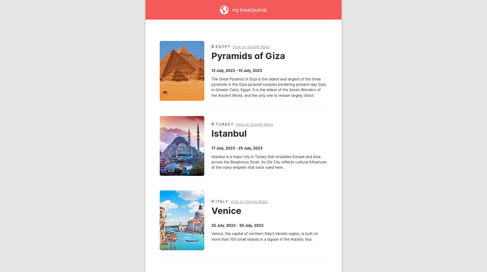

# react-travel-journal
A travel journal made with React.js as the second solo project from Scrimba React Course: https://scrimba.com/learn/learnreact

  

## What I learned
- How to use Props
- Destructuring props
- Mapping components using Array.map()
- Passing object as props

## How to use it
1. Clone this repo
2. Run `npm install`
3. Run `npm run div`

## Credits
- [Scrimba React Course](https://scrimba.com/learn/learnreact)

## License
